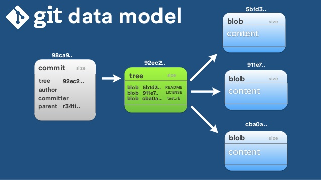

# Git: objects


## Contents of .git folder

When you run  _git init_  in a new or existing directory, Git creates the  _.git_  directory, which is where almost everything that Git stores and manipulates is located.
<br>
One thing to understand about git is that git doesn’t store  _diff_ of the contents of your files. It stores snapshots(the exact content of the files) at the point a commit is made. We are going to focus on the  _objects_ sub-directory, where all the content is stored. 
<br>
Git has 4 types of objects:
1.  blob — A blob object is used for storing the contents of a single file.
2.  tree — A tree object contains references to other blobs or subtrees.
3.  commit — A commit object contains the reference to another tree object and some other information(author, committer etc.)
4.  tag — A tag or a tag object is just another reference to a commit object and just makes for easier referencing.

## Going through an example
```
$ git init
```
This creates the  _.git_  directory with the all the sub-directories above but they are empty.
```
$ echo "hello" > hello.txt  
$ git add hello.txt
```
Staging a file creates the  _blob_  file in the  _objects_  sub-directory with the path  _.git/objects/4c/5fd919d52e3c1b08f7924cfa05d6de100912fd._ This blob has the contents of the file and has type  _blob._ A blob is essentially the content of the file at a particular instance.
```
$ git cat-file -p 4c5fd919d52e3c1b08f7924cfa05d6de100912fd  
$ hello
$ git cat-file -t 4c5fd919d52e3c1b08f7924cfa05d6de100912fd  
$ blob
```
_git cat-file_  is a command used to view the contents, type of objects.
<br>
If we create another file with **the same contents** as hello.txt
```
echo b > b.txt
git add .
```
We won't get new blob objects because they share the same contents.
<br>
Now we commits the file hello.txt
```
$ git commit -m "hello"  
[master 36b8081] hello  
 1 file changed, 1 insertion(+)  
 create mode 100644 first.txt

$ git log  
commit 2436b80815fde902030d71f08957f68a366dd91f  
Author: Nicole Han <...>  
Date:   Sat Aug 13 19:49:15 2016 +0530
First file
```
This creates two more object files in the object sub-directory. One is a tree object and other a commit object.
<br>
The commit object contains reference to a tree object. The tree object contains the reference to individual blob objects that we saw earlier.

On running _cat-file_ on the tree object referred by the second commit we see it contains reference to a blob for _hello.txt_(it didn’t change because the contents of the file didn’t change). If we were to modify the contents of _hello.txt,_ the blob reference would also be different here. 

## Tagging
There are two types of tags, lightweight and annotated tag. Annotated tags create the fourth type of objects — tag objects which just point to a commit. Lightweight tags don’t create any tag object. They just have a reference to the latest commit.
```
# creating a lightweight tag.  
$ git tag v0.1.0

# Sorry I lied, we will take a sneak peak into the _refs_ directory.   
$ cat .git/refs/tags/v0.1.0  
ca3917d421d303bba47a34c9069f3524d84ad7be

# Above is the SHA-1 of the latest commit# creating an annotated tag  
$ git tag -a v0.1.1  
$ cat .git/refs/tags/v0.1.1  
c236cc24750e43808dcef99d3a3372c9a1d94141$ git cat-file -t c236cc24750e43808dcef99d3a3372c9a1d94141  
tag  

$ git cat-file -p c236cc24750e43808dcef99d3a3372c9a1d94141  
object ca3917d421d303bba47a34c9069f3524d84ad7be  
type commit  
tag v0.1.1  
tagger Nicole Han <...> 1471101036 +0530

First tag
```
The tag object has a reference to the commit object which in turn has all the other information.
<br>

## Reference
[Pro git book](https://git-scm.com/book/en/v2)
[Git internals](https://medium.com/@pawan_rawal/demystifying-git-internals-a004f0425a70)
[Git BLOB/Commit/Tree](https://www.jianshu.com/p/8659c9ae00cb)